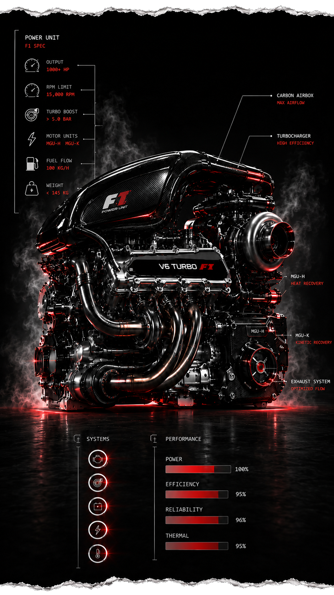

  

  

 

<h1>▪ ABOUT ME</h1>

🏎️ I started vibe coding in 2025 as a personal hobby and a way to turn ideas into real working products faster. I am not building projects just for code itself — I like creating useful tools that can solve everyday problems, improve services for people, and make complicated things easier to use.

I work on practical apps, SaaS tools, monitoring systems, testing tools, AI-assisted workflows, and small product ideas that can grow into something bigger. My current interests include mobile apps, public service tools, transport and city services, monitoring systems, testing, analytics, business dashboards, automation, and AI analytics.

 

One of my goals is to build simple and useful applications for real people: apps that help users check information faster, monitor important systems, understand data, receive alerts, and make better decisions without needing technical knowledge.

I use AI-assisted development as part of my workflow: planning, prototyping, debugging, improving interfaces, testing ideas, and turning rough concepts into working projects step by step.

For me, vibe coding is a mix of creativity, product thinking, problem solving, and constant learning.

---
# ▪ TECH STACK

  

  
  
  
  
  
  

  
  
  
  
  

  
  
  
  
  
  

  
  
  
  
  
  
  
  

  
  
  
  
  
  
  
  
  

  
  
  
  
  
  
  
  
  

  
  
  

  
  

  
  
  
  
  

  
  
  
  

  
  
  
  
  
  
  
  
  
  

  
  
  
  
  
  
  
  
  

 

---

## Projects

<table>
  <tr>
    <td align="center" width="50%">
      <h3>STM Balance</h3>
      
Android NFC project for STM transport cards in Montevideo.

      

        
        
        
      

      <a href="https://github.com/Aleksandr-Ignatenko/stm-balance">View Repository</a>
    </td>
    <td align="center" width="50%">
      <h3>Android Game Projects</h3>
      
Game projects developed with C# and Unity, including UFO Saucer Up and Yacht Sharing.

      

        
        
        
      

      <a href="https://github.com/Aleksandr-Ignatenko">View GitHub</a>
    </td>
  </tr>
</table>

---

## GitHub Dashboard

### GitHub Streak

---

### GitHub Activity Graph

---

### Languages and Repositories

<table>
  <tr>
    <td>
      
    </td>
    <td>
      
    </td>
    <td>
      
    </td>
  </tr>
</table>

---

### GitHub Stats

  

---

### Profile Summary Cards

<table>
  <tr>
    <td>
      
    </td>
    <td>
      
    </td>
  </tr>
</table>

---

## Top Repositories

<table>
  <tr>
    <td>
      
    </td>
    <td>
      
    </td>
  </tr>
</table>

---

## Contribution Chart

---

  
<strong>Git Stats Summary</strong>

   

  

  

    

  

    

  

  

---

  
<strong>GitHub Profile Trophy</strong>

   

  

  

    

  

  

---

  
<strong>GitHub Star History</strong>

   

  

  

  

---

## Repository Roster

  

---

## What I Work With

<table>
  <tr>
    <td align="center" width="33%">
      <h3>Telecom Business</h3>
      
A2P SMS, SMS termination, VoIP, voice termination, DID numbers, IP transit, hosting, connectivity, and colocation.

    </td>
    <td align="center" width="33%">
      <h3>Carrier Relations</h3>
      
Partner negotiations, route testing, traffic growth, pricing, quality monitoring, commercial disputes, and long-term cooperation.

    </td>
    <td align="center" width="33%">
      <h3>Development</h3>
      
C#, Unity, Android development, Unity projects, product thinking, and technical problem solving.

    </td>
  </tr>
</table>

---

### Open to telecom partnerships, carrier relations, SMS, voice, DID, hosting and connectivity opportunities.

 

---

# ▪ CONTACTS

| GitHub | Telegram | Email | Instagram | LinkedIn |
| --- | --- | --- | --- | --- |
|  |  |  |  |  |

---
